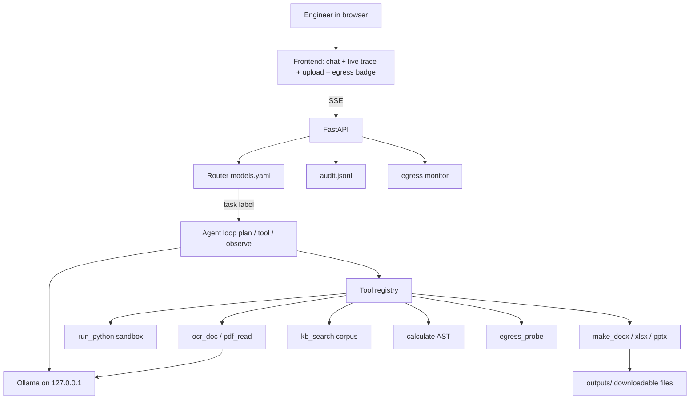
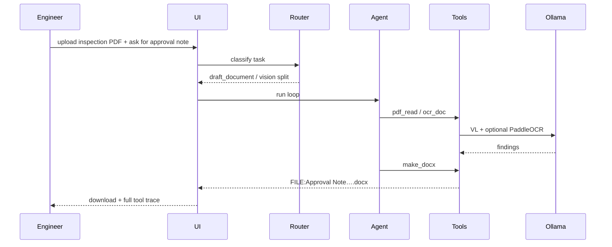

# Sovereign On-Premise Agentic AI Workbench

**SIH 2026 · Problem Statement `SIH26117`**  
**Organisation:** Mangalore Refinery and Petrochemicals Ltd (MRPL)  
**Theme:** Smart Automation · **Team:** LatentX · **Institute:** IIIT Bangalore

> A **multi-model agent harness** that runs entirely on the organisation's own GPU box.  
> It routes each task to the right open-weight model, calls real local tools, and can **show** that its own calls stayed local.

```
  THIS IS                          THIS IS NOT
  -------------------------        -------------------------
  local agent + tools              a ChatGPT skin
  model router (≥2 types)          one frozen model forever
  PDF/scan → Word deliverable      chat text pretending to be a note
  Docker / bwrap sandbox           code running on the host with Wi-Fi
  live egress DENY probe           "trust us, we are air-gapped" slide
```

## The industrial problem

Refinery and PSU knowledge work is routine and confidential at the same time:

- inspection PDFs and handwritten shift notes  
- P&ID drawings and tag lists  
- SOPs, LOTO procedures, vendor letters  
- spare-cost sheets and short analysis scripts  

None of that can be pasted into a public cloud assistant. Today the choice is slow manual drafting, or silent leakage into SaaS tools. The PS asks for a **sovereign on-premise agentic workbench** on mid-range GPU (or smaller open models), with auto model selection, OCR-to-document agents, sandboxed coding, multimodal reads, and visible proof of zero egress.

We build the **harness around open models**. We do not train a foundation model.

## System at a glance



ASCII twin (renders everywhere):

```
                 ┌──────────────────────────────────────┐
                 │  Browser UI                          │
                 │  chat · SSE trace · upload · badges  │
                 └──────────────────┬───────────────────┘
                                    │
                 ┌──────────────────▼───────────────────┐
                 │  FastAPI                             │
                 │  route → agent → tools → audit       │
                 └─┬───────────┬─────────────┬──────────┘
                   │           │             │
           ┌───────▼──┐  ┌─────▼─────┐  ┌───▼────────┐
           │  Router  │  │  Agent    │  │  Egress +  │
           │  yaml    │  │  ≤10 step │  │  audit log │
           └───────┬──┘  └─────┬─────┘  └────────────┘
                   │           │
                   │     ┌─────▼──────────────────────┐
                   │     │ Tools: OCR PDF sandbox KB  │
                   │     │ sheet calc docx xlsx pptx  │
                   │     └─────┬──────────────────────┘
                   │           │
                   └─────►┌────▼──────────────────────┐
                          │ Ollama  127.0.0.1:11434    │
                          │ qwen3 · coder · qwen3-vl   │
                          └───────────────────────────┘
```

## Mapped to the problem statement

Status labels: **implemented** = code complete · **tested** = covered by the
offline/browser suites · **verified** = exercised end-to-end on a live model
runtime. Anything not verified on this build is marked accordingly.

| PS requirement | How we meet it | Status |
| :---: | :--- | :---: |
| Multi-model backend, auto-select | `router.py` + `models.yaml`; capability-gated substitution (a vision task never falls back to a text/embedding model) | implemented + tested |
| New models without redesign | add a YAML block; `_resolve()` substitutes within compatible capabilities | implemented + tested |
| Agentic multi-step work | `agent.py` plan → tool → observe, max 10, UI trace, cancellable | implemented + tested |
| Local tools | 15 tools in `tools.py` (fs, sandbox, OCR, PDF, office, KB, sheets, calc, deliverables, probe) | implemented + tested |
| Scanned docs / handwriting / drawings | `ocr_doc`, `pdf_read` (+ optional PaddleOCR); image path is mock-tested only | implemented + offline-tested |
| Real deliverables | `make_docx` / `make_xlsx` / `make_pptx` / `compose_deck`; success requires the artifact to verify on disk | implemented + tested |
| Grounded in local manuals | `kb_search` over `corpus/` (embed + keyword hybrid) | implemented + tested |
| Proof of no external calls | `/api/egress` + `/api/egress/probe` + `audit.jsonl`; probe reports blocked / reachable / inconclusive honestly | implemented + tested |

## Four demos that win the room



1. **Router proof**  
   Ask a SOP summary, then a coding task. Header shows two different model ids.

2. **Document proof**  
   Attach `workspace/inspection_report.pdf` (or any scan). Trace shows extract → draft → `.docx` download.

3. **Sandbox proof**  
   “Count ERROR lines in `log_sample.txt`.” Result prefix names the isolation tier (`docker` / `bubblewrap`). If neither is available the tool returns an explicit error — generated code never runs on the host.

4. **Egress proof**  
   Click the probe. Rows show DENIED for HTTPS/DNS. Badge stays at external calls = 0 during normal work.

Detailed click order: [`docs/DEMO_SCRIPT.md`](docs/DEMO_SCRIPT.md).

## How a single request is decided

Two decisions, not one:

```
                 message + optional file
                           |
                           v
                 ┌─────────────────────┐
                 │  classify task      │
                 │  keywords first,    │
                 │  else local LLM     │
                 └──────────┬──────────┘
                            |
              ┌─────────────┴─────────────┐
              v                           v
     pick MODEL for task          pick ORCHESTRATOR
     (vl for image labels)        (reasoning model drives loop
                                   when task is vision)
              |                           |
              └─────────────┬─────────────┘
                            v
                   agent JSON actions
                   tool | final answer
```

Why the split: a vision model is strong at reading a P&ID and weak at running a five-step job. The VL model reads through `ocr_doc`; the reasoning model plans. Both appear in the API response and UI.

## Model registry (preferred)

| Role | Ollama tag | Notes |
| :---: | :--- | :--- |
| Orchestration / drafts | `qwen3:8b` | default in `models.yaml` |
| Coding | `qwen2.5-coder:7b` | write_code / debug |
| Vision | `qwen3-vl:8b` | scans, drawings, handwriting |
| Vision fallback | `qwen3-vl:4b` | tighter VRAM |
| Embeddings | `nomic-embed-text` | local KB |
| Legacy substitutes | `qwen2.5:7b-instruct`, `qwen2.5vl:3b`, … | still listed so old pulls keep working |

Optional OCR: `pip install paddlepaddle paddleocr`. If present, scans get a deterministic Paddle pass before VL. If absent, vision-only (no crash).

## Sandbox tiers (named in the tool output)

```
  run_python(code)
        |
        +-->[1] docker run --network none …   strongest: container, no NIC
        |
        +-->[2] bubblewrap (bwrap) …          rootless, restricted mounts, no net
        |
        +-->[x] neither available             explicit error, nothing executes
```

There is no host-interpreter fallback. If no isolation tier exists, `run_python`
refuses to run and says so — the string in the result names the actual tier.

## Expected outcomes (scripted demo checks)

**Hardware:** GPU workstation (16 GB class) · Ollama local  
**Models:** `qwen3:8b` + `qwen3-vl:8b` (or `4b`) preferred; legacy `qwen2.5` tags substitute automatically.

These rows are the demo's acceptance checks, not a benchmark. Rows marked
*(verified)* were run end-to-end on this build with live models on a 16 GB GPU
workstation (19-Sep-2026); rows marked *(historical)* were observed on a
previous build and are re-verified on each deployment.

| Task | Outcome |
| :--- | :--- |
| Sandbox: count `ERROR` in `log_sample.txt` | **3** lines · `[sandbox: bubblewrap, network=none]` *(verified)* |
| KB: vibration alert limit for pump P-201 | **4.5 mm/s RMS** · SOP-MECH-041 *(verified)* |
| `spares.xlsx` + 18% GST → approval Word file | **Rs 62304** · verified `.docx` on disk *(verified)* |
| `pid_crude_transfer.png` | tags VI/TI/PI on P-201 + 4.5 mm/s RMS *(verified)* |
| Outbound socket inside sandbox | `Errno 101` — connection blocked for real *(verified)* |
| `scanned_report.png` | seal **14 drops/min** (limit 10) · bearing **74.8 C** *(historical)* |
| `inspection_report.pdf` (text + scanned pages) | both layers recovered *(historical)* |
| `handwritten_shift_note.png` | shift time, actions, signer *(historical)* |
| Egress probe | every row reports its real state; **DENIED** only when the probe actually ran and failed to connect *(verified)* |

## Run in three steps

```bash
bash scripts/setup.sh
cd backend && ../.venv/bin/uvicorn main:app --host 0.0.0.0 --port 8000
# open http://localhost:8000
```

Manual model pulls:

```bash
ollama pull qwen3:8b
ollama pull qwen2.5-coder:7b
ollama pull qwen3-vl:8b
ollama pull qwen3-vl:4b
ollama pull nomic-embed-text
```

Offline suite (no GPU required):

```bash
python tests/test_offline.py                    # 87 checks: routing, scopes, artifacts, uploads, audit, sandbox
.venv/bin/python -m pytest tests/test_browser.py # 18 checks: real-browser streaming, cancel, downloads, probes
```

The offline suite is fully mocked — it verifies control flow, not model quality.
Real-model verification happens on the deployment runtime, per run.

## Repository map

```
SIH26117/
├── backend/
│   ├── main.py            API: chat, stream, cancel, upload, egress, audit
│   ├── agent.py           plan → act → observe, scope-wrapped tool calls
│   ├── router.py          task classify + capability-aware model resolve
│   ├── tools.py           15 local tools + per-request file scopes
│   ├── sandbox.py         docker / bubblewrap execution, no host fallback
│   ├── calc.py            safe AST math
│   ├── audit.py           metadata-only audit log (sizes + digests)
│   ├── ollama_client.py   127.0.0.1 only, think-tag stripping
│   └── models.yaml        registry (edit here to add models)
├── frontend/index.html    UI + SSE trace + probe + cancel
├── corpus/                synthetic SOPs / correspondence
├── workspace/             demo PDF, P&ID, scan, log, xlsx
├── outputs/               generated deliverables
├── scripts/setup.sh       runtime + pulls + tests
├── docs/
│   ├── DEMO_SCRIPT.md     judge run order
│   └── ARCHITECTURE.md    design decisions
└── tests/
    ├── test_offline.py    routing, scopes, artifacts, uploads, audit, sandbox
    └── test_browser.py    real-browser UI: stream, cancel, downloads, probes
```

Sample workspace files are **synthetic**, written for the PS rule of open/sample data only. No proprietary MRPL documents are in this repo.

## What we refuse to overclaim

- We show **process / sandbox / probe** evidence. We do not claim a formal air-gap certification, and the audit log covers instrumented application calls only — not every process or native library on the host.
- Machine-wide egress scope counts every process on the host. Use a dedicated demo machine for that mode.
- File access is enforced in code per request (a task scope resolves which workspace files the agent may touch); the system prompt is not the access boundary.
- A "task succeeded" response requires the deliverable to verify on disk — right format, inside `outputs/`, within size limits. A failed generation cannot be talked into a success.
- Small local models can emit messy JSON; the parser retries known shapes. That is why the offline tests exist.
- This nomination POC is the harness. Plant DCS/SCADA connectors, SSO, and K8s are out of scope for the sheet deadline.

## Team · LatentX (IIIT Bangalore)

Anish Reddy · P Lohith · Harsha Vardhan D · P Prajwal · Munjikesh · Hasini

**Docs:** [Demo script](docs/DEMO_SCRIPT.md) · [Architecture](docs/ARCHITECTURE.md)
